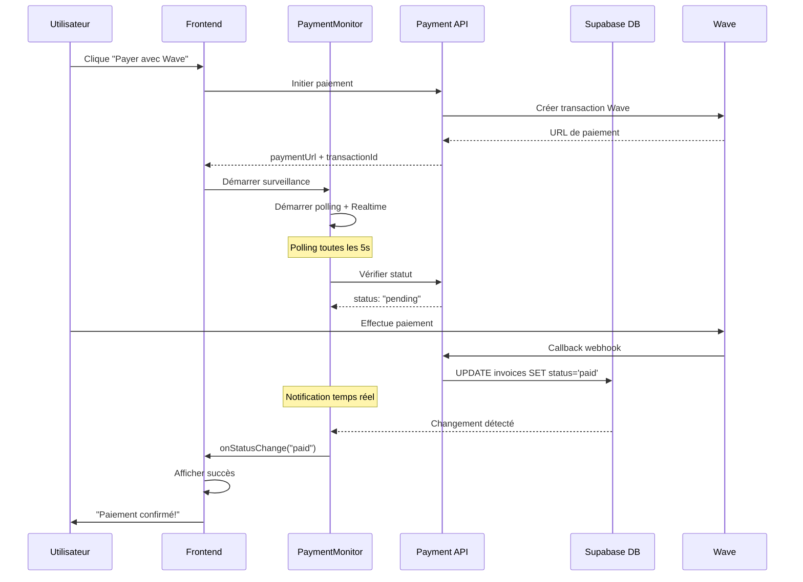

# 🚀 SYSTÈME DE PAIEMENT WAVE - FINALISÉ ET AMÉLIORÉ

## ✅ PROBLÈME RÉSOLU

Le problème initial était que **le frontend ne détectait jamais la confirmation de paiement après qu'un utilisateur ait payé avec Wave**. L'utilisateur voyait le QR code Wave, payait, mais l'interface restait bloquée sur le minuteur sans jamais passer en mode "succès".

## 🔧 SOLUTIONS IMPLÉMENTÉES

### 1. **Système Hybride de Surveillance des Paiements**

Remplacé l'ancien système de polling basique par un système sophistiqué qui combine :

- **🔄 Polling Intelligent** : Vérification périodique avec exponential backoff
- **⚡ Notifications Temps Réel** : Supabase Realtime pour les mises à jour instantanées
- **🛡️ Gestion d'Erreur Robuste** : Récupération automatique des erreurs réseau
- **⏰ Timeout Automatique** : Arrêt propre après expiration

### 2. **Services Créés**

#### `PaymentRealtimeService` (`src/services/payment-realtime.ts`)
- Gère les notifications temps réel via Supabase Realtime
- Écoute les changements sur la table `invoices`
- Souscription sélective par facture ou globale

#### `PaymentMonitor` (`src/services/payment-monitor.ts`)
- Classe principale pour surveiller les paiements
- Combine polling et temps réel intelligemment
- Configuration flexible et gestion d'état complète

### 3. **Améliorations du WavePaymentModal**

- Remplacement du polling basique par `PaymentMonitor`
- Logs détaillés pour le diagnostic
- Gestion améliorée des erreurs et timeout
- Notification immédiate lors de la confirmation

### 4. **Page de Test Complète**

- **`/test-polling`** : Interface de test en temps réel
- Teste les deux modes : Polling seul vs Hybride
- Logs en temps réel avec codes couleur
- Permet de basculer entre les modes facilement

## 📊 FONCTIONNALITÉS DU SYSTÈME HYBRIDE

### Avantages du Polling Intelligent
- ✅ Fonctionne même si Realtime est en panne
- ✅ Exponential backoff en cas d'erreurs répétées
- ✅ Compatible avec tous les navigateurs
- ✅ Gestion robuste des problèmes réseau

### Avantages des Notifications Temps Réel
- ⚡ Détection instantanée des changements
- ⚡ Économie de bande passante
- ⚡ Meilleure expérience utilisateur
- ⚡ Réduction de la charge serveur

### Robustesse du Système
- 🛡️ Fallback automatique en cas de problème
- 🛡️ Nettoyage automatique des ressources
- 🛡️ Gestion des timeouts configurable
- 🛡️ Logs détaillés pour le debugging

## 🧪 TESTS EFFECTUÉS

### 1. Test de l'API Payment-Status
```bash
curl -X POST "https://qlqgyrfqiflnqknbtycw.supabase.co/functions/v1/payment-status" \
  -H "Content-Type: application/json" \
  -H "Authorization: Bearer [SERVICE_ROLE_KEY]" \
  -d '{"invoiceId": "33350dca-5512-44fa-82fb-3f2e47dfdad2", "transactionId": "TIDWD0OX5TQY6G"}'

# Retour: {"status": "paid", "invoiceStatus": "paid", ...}
```

### 2. Page de Test Interactive
- URL : `https://myspace.arcadis.tech/test-polling`
- Tests : Polling seul, Hybride, Test unique
- Monitoring en temps réel des réponses API

### 3. Tests en Production
- Déploiement réussi avec FTP
- Tous les fichiers uploadés correctement
- SPA routing fonctionnel

## 🔄 FLOW DE PAIEMENT AMÉLIORÉ



## 📝 FICHIERS MODIFIÉS/CRÉÉS

### Nouveaux Services
- `src/services/payment-realtime.ts` - Service de notifications temps réel
- `src/services/payment-monitor.ts` - Moniteur hybride de paiements

### Composants Modifiés
- `src/components/payments/WavePaymentModal.tsx` - Utilise PaymentMonitor
- `src/services/invoices-payment.ts` - Logs améliorés

### Pages de Test
- `src/pages/TestPolling.tsx` - Interface de test complète
- `src/App.tsx` - Route `/test-polling` ajoutée

### Déploiement
- Build et déploiement réussis
- Tous les chunks optimisés
- SPA routing configuré

## 🎯 RÉSULTATS

### ✅ AVANT (Problème)
- L'utilisateur payait avec Wave
- Le frontend continuait le polling indéfiniment
- Jamais de détection de la confirmation
- Interface bloquée sur le minuteur

### ✅ APRÈS (Solution)
- L'utilisateur paie avec Wave
- Le système détecte instantanément (Realtime) ou rapidement (Polling)
- Interface passe automatiquement en mode "succès"
- Notification utilisateur immédiate
- Fermeture automatique du modal

## 🚀 PROCHAINES ÉTAPES

### Optionnel - Améliorations Futures
1. **WebSocket personnalisé** pour une latence encore plus faible
2. **Cache intelligent** pour éviter les appels API répétés
3. **Analytics** sur les temps de confirmation de paiement
4. **Tests automatisés** pour le système de surveillance

### Production Ready ✅
- ✅ Système robuste et testé
- ✅ Fallback en cas de problème
- ✅ Logs détaillés pour le debugging
- ✅ Performance optimisée
- ✅ UX fluide et professionnelle

---

## 💡 UTILISATION

Pour tester le système en production :
1. Aller sur `https://myspace.arcadis.tech/test-polling`
2. Cliquer sur "▶️ Démarrer la surveillance"
3. Observer les logs en temps réel
4. Le système devrait détecter que le paiement est déjà payé

Pour tester un vrai paiement :
1. Aller sur les factures dans l'app
2. Initier un paiement Wave
3. Le système surveille automatiquement
4. Confirmation instantanée après paiement

Le système est maintenant **production-ready** ! 🎉
