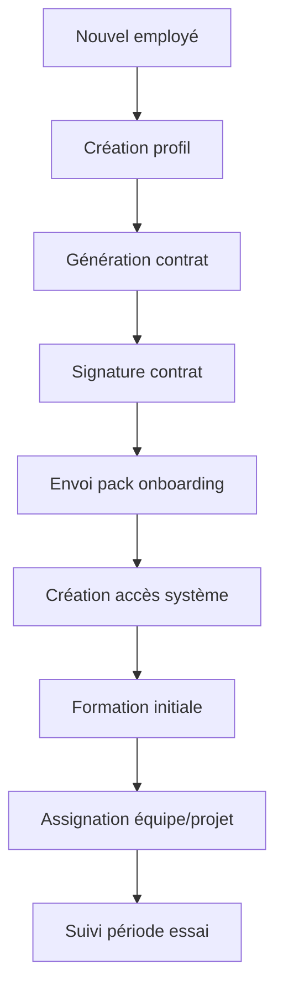

# Plan d'Intégration RH - Enterprise OS

## 🎯 Objectif Global
Transformer l'application actuelle en un système d'entreprise complet avec gestion des ressources humaines, permettant une gestion centralisée des employés, contrats, onboarding, et processus RH avec signature numérique.

## 📋 État Actuel
- ✅ Système de paramètres globaux (devise, contexte métier)
- ✅ Design system unifié et thème moderne
- ✅ Modules de base : Factures, Devis, Dashboard Analytics
- ✅ Architecture internationale et modulaire
- ⏳ Module Projet (en cours - Kanban drag & drop)
- ⏳ Module Équipes (préparation)
- ⏳ Module Analytics avancé (préparation)

## 🚀 Phase 1 : Architecture RH et Gestion des Employés

### 1.1 Base de Données RH
```sql
-- Nouvelles tables à créer
- employees (employés)
- departments (départements)
- positions (postes)
- contracts (contrats)
- employee_documents (documents employés)
- payroll (paie)
- attendance (présences)
- leave_requests (demandes de congés)
- performance_reviews (évaluations)
- training_records (formations)
- employee_roles (rôles système)
```

### 1.2 Types TypeScript RH
```typescript
// Types principaux à créer
- Employee
- Department
- Position
- Contract
- EmployeeDocument
- PayrollRecord
- AttendanceRecord
- LeaveRequest
- PerformanceReview
- TrainingRecord
- EmployeeRole
```

### 1.3 Services API RH
```typescript
// Services à implémenter
- employeeApi.ts
- departmentApi.ts
- contractApi.ts
- payrollApi.ts
- attendanceApi.ts
- leaveApi.ts
- performanceApi.ts
- trainingApi.ts
```

## 🔐 Phase 2 : Système de Rôles et Accès

### 2.1 Hiérarchie des Rôles
```
SUPER_ADMIN (Administrateur système)
├── HR_MANAGER (Gestionnaire RH)
├── DEPARTMENT_MANAGER (Chef de département)
├── PROJECT_MANAGER (Chef de projet)
├── TEAM_LEAD (Chef d'équipe)
├── EMPLOYEE (Employé standard)
└── CLIENT (Client externe)
```

### 2.2 Permissions par Module
```
Module Employés:
- SUPER_ADMIN: Tout
- HR_MANAGER: Tout sauf suppression définitive
- DEPARTMENT_MANAGER: Lecture équipe + modification limitée
- EMPLOYEE: Lecture profil personnel + modification limitée

Module Contrats:
- SUPER_ADMIN: Tout
- HR_MANAGER: Création, modification, signature
- DEPARTMENT_MANAGER: Lecture département
- EMPLOYEE: Lecture contrats personnels

Module Paie:
- SUPER_ADMIN: Tout
- HR_MANAGER: Tout
- EMPLOYEE: Lecture bulletins personnels

Module Projets:
- SUPER_ADMIN: Tout
- PROJECT_MANAGER: Gestion projets assignés
- TEAM_LEAD: Gestion tâches équipe
- EMPLOYEE: Tâches assignées
```

### 2.3 Composants d'Accès
```typescript
// Composants à créer
- RoleGuard
- PermissionCheck
- AccessControl
- UserRoleProvider
```

## 📝 Phase 3 : Module Gestion des Employés

### 3.1 Interface de Gestion
- **Liste des employés** avec filtres (département, poste, statut)
- **Profil employé** complet (informations personnelles, contrat, historique)
- **Organigramme interactif** par département
- **Recherche intelligente** avec IA (compétences, expérience)

### 3.2 Fiche Employé Complète
```typescript
interface EmployeeProfile {
  personalInfo: PersonalInfo;
  contractInfo: ContractInfo;
  documents: EmployeeDocument[];
  skills: Skill[];
  projects: ProjectAssignment[];
  performance: PerformanceRecord[];
  training: TrainingRecord[];
  attendance: AttendanceRecord[];
}
```

### 3.3 Composants UI
- `EmployeeList.tsx`
- `EmployeeCard.tsx`
- `EmployeeProfile.tsx`
- `EmployeeForm.tsx`
- `OrganizationChart.tsx`
- `SkillsMatrix.tsx`

## 📄 Phase 4 : Gestion des Contrats et Documents

### 4.1 Types de Contrats
- CDI (Contrat à durée indéterminée)
- CDD (Contrat à durée déterminée)
- Stage
- Freelance/Consultant
- Temps partiel

### 4.2 Génération Automatique
- **Templates de contrats** par type et pays
- **Variables dynamiques** (nom, poste, salaire, etc.)
- **Clauses personnalisables** selon le contexte métier
- **Génération PDF** avec mise en page professionnelle

### 4.3 Signature Numérique
- **Workflow de signature** : RH → Manager → Employé
- **Intégration e-signature** (DocuSign, Adobe Sign, ou solution custom)
- **Historique des signatures** et traçabilité
- **Notifications automatiques** de suivi

### 4.4 Gestion Documentaire
- **Stockage sécurisé** (Supabase Storage)
- **Classification** par type et employé
- **Versioning** des documents
- **Archivage automatique**

## 🎓 Phase 5 : Processus d'Onboarding

### 5.1 Workflow d'Intégration


### 5.2 Pack d'Onboarding
- **Guide d'accueil** personnalisé
- **Charte d'entreprise** interactive
- **Processus et procédures**
- **Contacts utiles**
- **Checklist d'intégration**

### 5.3 Suivi d'Intégration
- **Timeline d'onboarding** avec étapes
- **Feedback automatisé** (1 semaine, 1 mois, 3 mois)
- **Évaluation période d'essai**
- **Ajustements personnalisés**

## 💰 Phase 6 : Gestion de la Paie

### 6.1 Calcul Automatique
- **Salaire de base** par contrat
- **Heures supplémentaires** calculées depuis les présences
- **Primes et bonus** configurables
- **Déductions** (taxes, sécurité sociale, etc.)
- **Variables par pays** (taux de change, réglementations)

### 6.2 Bulletins de Paie
- **Génération PDF automatique**
- **Templates personnalisables** par pays
- **Envoi sécurisé** aux employés
- **Archivage digital**

### 6.3 Rapports Financiers
- **Masse salariale** par période
- **Coûts par département/projet**
- **Prévisions budgétaires**
- **Export comptabilité**

## 📊 Phase 7 : Présences et Congés

### 7.1 Système de Pointage
- **Pointage web/mobile**
- **Géolocalisation** (optionnelle)
- **Reconnaissance faciale** (future)
- **Intégration badges RFID** (future)

### 7.2 Gestion des Congés
- **Demande en ligne** avec workflow
- **Validation hiérarchique**
- **Calendrier équipe** partagé
- **Solde de congés** en temps réel
- **Types de congés** configurables

### 7.3 Rapports de Présence
- **Heures travaillées** par employé/période
- **Taux d'absentéisme**
- **Heures supplémentaires**
- **Tendances et analytics**

## 🎯 Phase 8 : Évaluations et Performance

### 8.1 Cycles d'Évaluation
- **Évaluations périodiques** (annuelles, semestrielles)
- **Objectifs SMART** trackés
- **Auto-évaluation** + évaluation manager
- **Feedback 360°** (collègues, équipe)

### 8.2 Suivi des Objectifs
- **KPIs personnalisés** par poste
- **Dashboard performance** individuel
- **Évolution des compétences**
- **Plans de développement**

### 8.3 Analytics RH
- **Taux de rétention**
- **Satisfaction employés**
- **Performance par département**
- **Prédictions IA** (risque de départ, potentiel)

## 🎓 Phase 9 : Formation et Développement

### 9.1 Catalogue de Formations
- **Formations internes** et externes
- **E-learning** intégré
- **Certifications** trackées
- **Parcours personnalisés**

### 9.2 Gestion des Compétences
- **Matrice de compétences** par poste
- **Gap analysis** automatique
- **Recommandations formation** IA
- **Évolution de carrière**

## 🔄 Phase 10 : Intégration avec Modules Existants

### 10.1 Module Projets
- **Assignation automatique** selon compétences
- **Tracking temps** par projet/employé
- **Coût réel** vs budget projet
- **Performance équipe** projet

### 10.2 Module Analytics
- **KPIs RH** intégrés au dashboard
- **Corrélations** performance/satisfaction
- **Prédictions** business + RH
- **ROI formation** et recrutement

### 10.3 Module Facturation
- **Temps facturable** par employé
- **Coût horaire** automatique
- **Marge par projet** incluant RH
- **Facturation client** basée temps réel

## 🚀 Roadmap d'Implémentation

### Sprint 1 (Semaines 1-2) : Fondations
- [ ] Migration base de données RH
- [ ] Types TypeScript de base
- [ ] Services API employés
- [ ] Système de rôles basique

### Sprint 2 (Semaines 3-4) : Gestion Employés
- [ ] Interface liste employés
- [ ] Profil employé complet
- [ ] Formulaires création/édition
- [ ] Organigramme basique

### Sprint 3 (Semaines 5-6) : Contrats et Documents
- [ ] Templates de contrats
- [ ] Génération PDF
- [ ] Workflow signature
- [ ] Stockage documents

### Sprint 4 (Semaines 7-8) : Onboarding
- [ ] Processus d'intégration
- [ ] Pack d'accueil
- [ ] Suivi timeline
- [ ] Notifications automatiques

### Sprint 5 (Semaines 9-10) : Présences et Congés
- [ ] Système pointage
- [ ] Gestion demandes congés
- [ ] Calendrier équipe
- [ ] Rapports présence

### Sprint 6 (Semaines 11-12) : Paie et Analytics
- [ ] Calcul paie automatique
- [ ] Bulletins PDF
- [ ] Analytics RH
- [ ] Intégration modules existants

## 📁 Structure des Fichiers

```
src/
├── components/
│   └── modules/
│       └── hr/
│           ├── employees/
│           ├── contracts/
│           ├── onboarding/
│           ├── payroll/
│           ├── attendance/
│           ├── performance/
│           └── training/
├── services/
│   └── hr/
│       ├── employeeApi.ts
│       ├── contractApi.ts
│       ├── payrollApi.ts
│       └── ...
├── types/
│   └── hr/
│       ├── employee.ts
│       ├── contract.ts
│       └── ...
├── hooks/
│   └── hr/
│       ├── useEmployees.ts
│       ├── useContracts.ts
│       └── ...
└── pages/
    └── hr/
        ├── employees/
        ├── contracts/
        ├── onboarding/
        └── ...
```

## 🔧 Technologies et Outils

### Frontend
- **React 18** avec TypeScript
- **Design System** existant (Twenty.com inspired)
- **Drag & Drop** (react-beautiful-dnd)
- **PDF Generation** (react-pdf)
- **Charts** (recharts, chartjs)
- **Forms** (react-hook-form + zod)

### Backend
- **Supabase** (PostgreSQL + Auth + Storage)
- **Edge Functions** pour logique métier
- **Row Level Security** pour permissions
- **Real-time** pour notifications

### Intégrations
- **E-signature** (DocuSign/Adobe Sign API)
- **Email** (Supabase/SendGrid)
- **Calendar** (Google Calendar API)
- **Export** (PDF/Excel/CSV)

## 🎨 Design Guidelines

### Interface RH
- **Tableau de bord** RH avec métriques clés
- **Navigation** intuitive par modules
- **Couleurs** cohérentes avec design system
- **Responsive** pour mobile/tablet
- **Accessibilité** WCAG 2.1 AA

### Expérience Employé
- **Self-service** portal pour employés
- **Mobile-first** pour pointage/congés
- **Notifications** push en temps réel
- **Interface** simple et moderne

## 📈 Métriques de Succès

### Techniques
- [ ] Temps de chargement < 2s
- [ ] 99.9% uptime
- [ ] 0 erreurs critiques
- [ ] Tests coverage > 80%

### Fonctionnelles
- [ ] Réduction 50% temps admin RH
- [ ] 90% satisfaction employés
- [ ] 100% contrats dématérialisés
- [ ] Onboarding < 2 jours

### Business
- [ ] ROI positif en 6 mois
- [ ] Réduction coûts RH 30%
- [ ] Amélioration rétention 20%
- [ ] Compliance 100%

## 🔒 Sécurité et Compliance

### Données Personnelles (RGPD)
- [ ] Consentement explicite
- [ ] Droit à l'oubli
- [ ] Portabilité données
- [ ] Chiffrement bout en bout

### Sécurité Système
- [ ] Authentification 2FA
- [ ] Audit logs complets
- [ ] Backup automatique
- [ ] Tests sécurité réguliers

## 📞 Support et Formation

### Documentation
- [ ] Guide utilisateur par rôle
- [ ] API documentation
- [ ] Video tutorials
- [ ] FAQ interactive

### Formation
- [ ] Sessions RH managers
- [ ] Training employés
- [ ] Support technique
- [ ] Change management

---

## 🎯 Prochaines Étapes Immédiates

1. **Valider l'architecture** avec les stakeholders
2. **Prioriser les modules** selon les besoins métier
3. **Commencer Sprint 1** (fondations techniques)
4. **Organiser la documentation** existante
5. **Préparer l'environnement** de développement

Cette roadmap transformera progressivement l'application en un véritable **Enterprise OS** avec une gestion RH complète, moderne et internationale.
